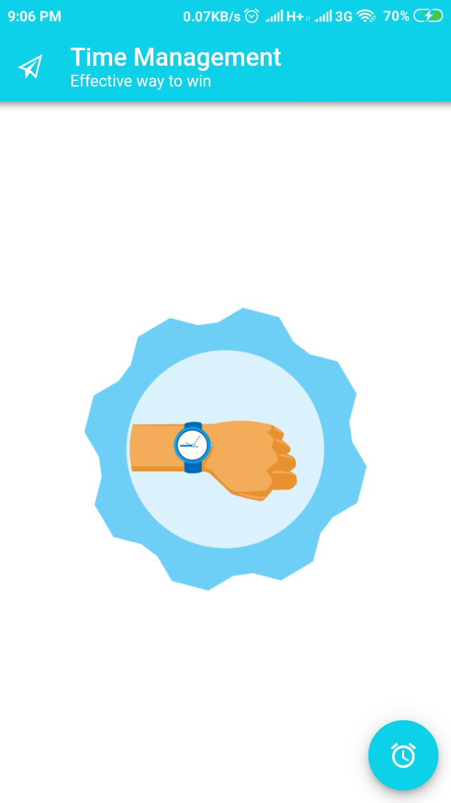
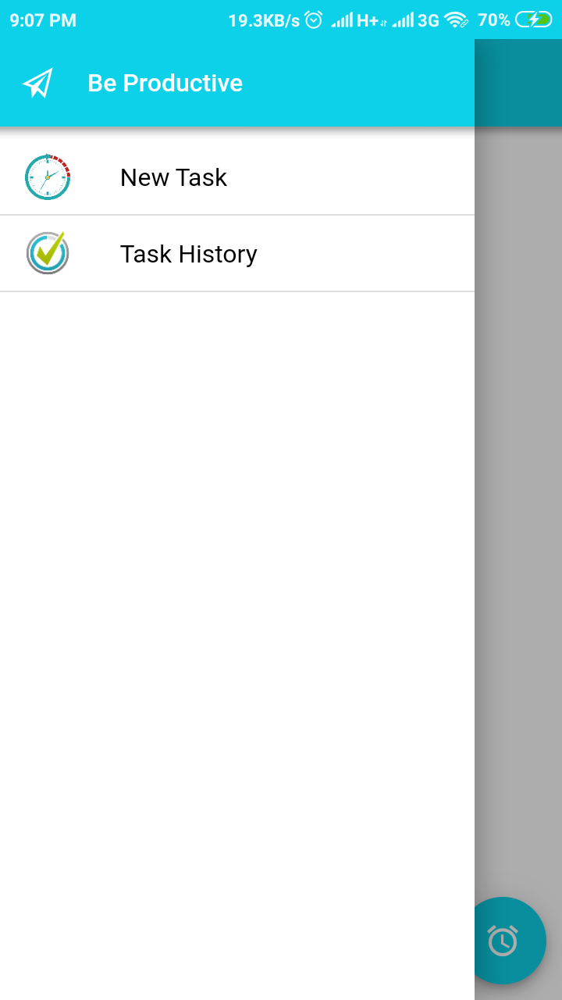
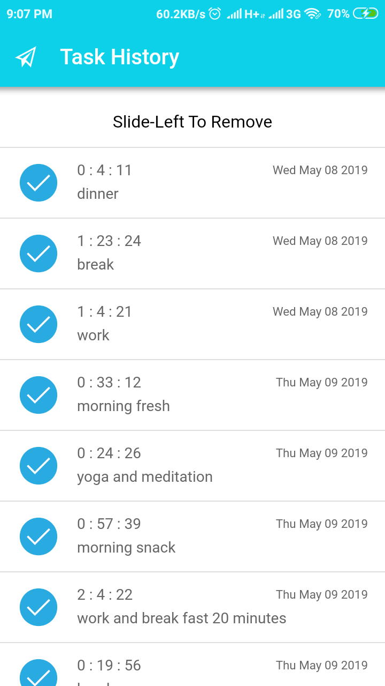
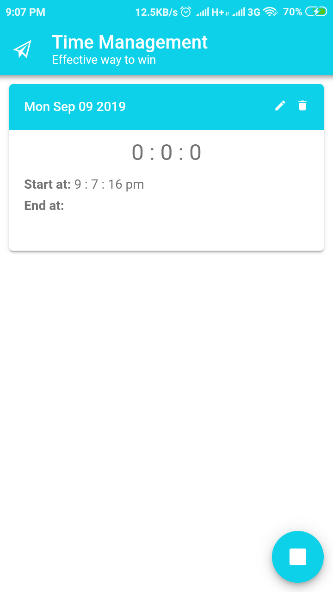

# Timer-Ionic4 

This app is about the basic example of ionic4 app with some usefull features like
  1. Add New Task
  2. Stop or complete the Task
  3. View Task History
  4. Swipe to delete history item
  
  This app will show you the exact time you spend on a task by calculating from start time to end time of the task.

You will see the output like

# Home Screen

# Side menu

# Task History

# New Task

# Live Demo
[Ionic 4 Timer app](https://sbsharma.com/ionic-4-timer-app/)

# Contributor
[Satpal Bhardwaj](https://sbsharma.com/ionic/)

# Follow us

